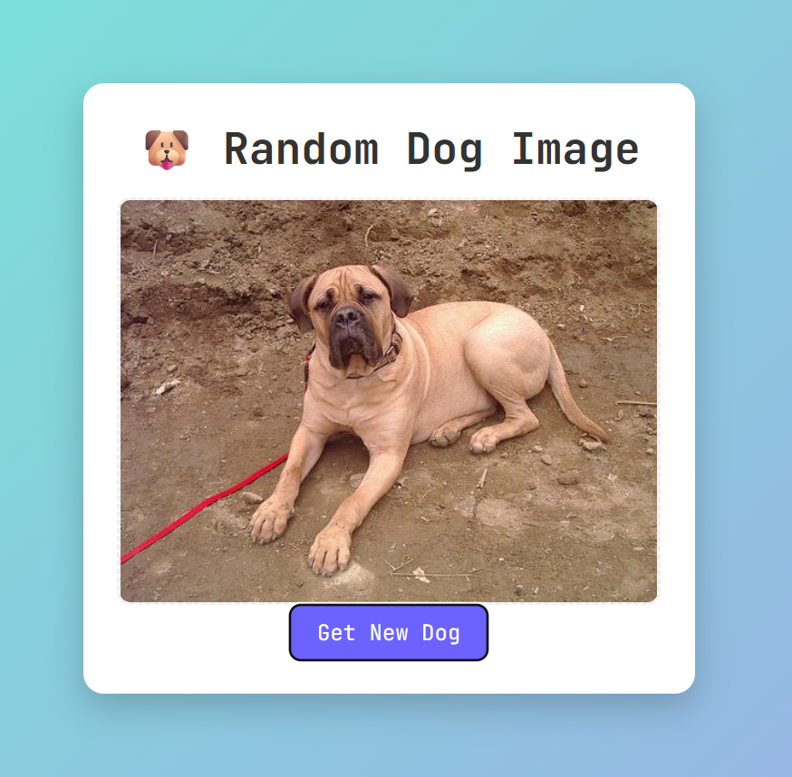

# 🐶 Random Dog Image Generator

A simple and fun web application that fetches and displays random dog images using the **Dog CEO Public API**.  
Built with **HTML, CSS, JavaScript**, and **Axios** using `async/await`.

---


## 📸 Screenshot




---

## 🛠️ Tech Stack
- **HTML5** – Structure  
- **CSS3** – Styling & Layout  
- **JavaScript (ES6+)** – Logic  
- **Axios** – API Requests  
- **Dog CEO API** – Random Dog Images  

---

## 📸 Features
- Fetches a random dog image on button click
- Uses `async/await` for API handling
- Responsive and clean UI
- Error handling for failed API calls

---

## ⚙️ How It Works
1. User clicks **"Get New Dog"**
2. Axios sends a request to the Dog CEO API
3. API returns a random dog image URL
4. Image is displayed dynamically on the page

---

## 🧪 API Used
**Dog CEO API**  
https://dog.ceo/api/breeds/image/random


---

## 🖥️ Setup & Run Locally
 Clone the repository
```bash
git clone https://github.com/AniruddhRajput-56/dog-api-project.git
